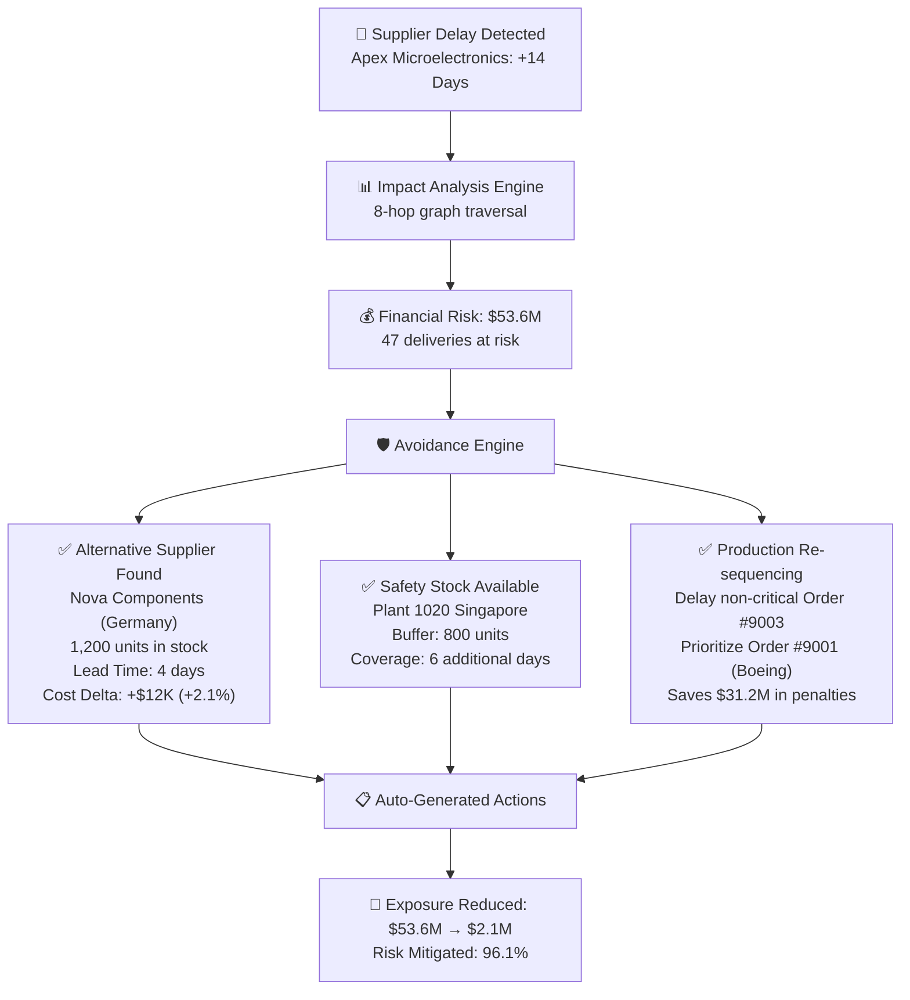
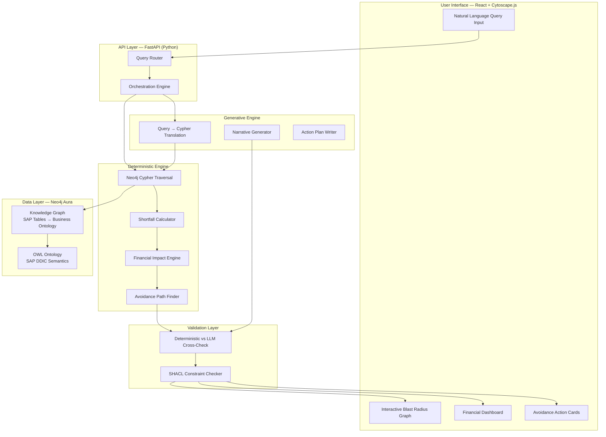

# AI-Powered SAP Knowledge Graph — Self-Healing Supply Chain Intelligence

## The Pitch (One Sentence)

> **"Before a $340M supplier delay cascades into 47 missed customer deliveries, our system has already re-routed the materials, drafted alternate POs, and sent the CFO a 1-page financial impact brief — autonomously."**

This is NOT an alerting system. This is a **Preventive Supply Chain Immune System**.

---

## Problem Statement Recap

The hackathon asks:
> *"If a supplier is delayed, which materials, plants, production orders, and customer deliveries will be affected, and why?"*

### Why This is Hard

SAP stores data across 15+ cryptic tables (`LFA1`, `EKPO`, `AFKO`, `RESB`, `VBAP`, etc.) with implicit foreign keys. No single SQL query, no RAG vector search, and no pure LLM can:
1. **Traverse 8+ hops** from a delayed supplier → PO schedule lines → material shortfalls → BOM dependencies → production order delays → sales order misses → customer delivery failures
2. **Compute exact financial exposure** per hop (quantity × unit cost × penalty clauses)
3. **Discover alternative paths** (alternate suppliers, safety stock buffers, plant re-routing)

---

## What Makes Our Solution Unique: The Three Pillars

Most teams will build a graph that shows "Supplier X is delayed → these things are affected." That's **reactive alerting**. Here's what differentiates us:

### Pillar 1: Financial Quantification Engine ("Speak in Dollars, Not Nodes")

> [!IMPORTANT]
> Business leaders don't care about graph nodes. They care about **"How much money are we losing?"**

Every node in our blast radius carries a **dollar-denominated risk score**:

| Hop | What SAP Tracks | What We Compute |
|-----|----------------|-----------------|
| Supplier → PO | `EKPO.NETWR` (PO line value) | **PO Stranded Value**: $2.4M in open PO commitments now at risk |
| PO → Material | `MARC.LABST` (plant stock), `MARD.LABST` (storage stock) | **Stock Coverage Gap**: Current stock covers 6 days, delay is 14 days → **8-day shortfall** |
| Material → Production Order | `RESB.BDMNG` (required qty), `AFKO.GLTRP` (finish date) | **Production Halt Cost**: Idle plant cost × days halted = **$180K/day** |
| Production → Sales Order | `VBAP.NETWR` (order value), `VBAP.KWMENG` (qty) | **Revenue at Risk**: Sum of downstream sales orders = **$47.2M** |
| Sales → Customer Delivery | `LIKP.LFDAT` (delivery date), penalty clauses | **Penalty Exposure**: Contractual late-delivery penalties = **$3.8M** |
| **TOTAL** | | **Aggregate Financial Exposure: $53.6M** |

The **dashboard headline** is always a single number:

```
╔══════════════════════════════════════════════════╗
║  ⚠️  PROJECTED FINANCIAL EXPOSURE: $53.6M       ║
║  Affecting: 12 POs, 8 Materials, 5 Plants,      ║
║  23 Production Orders, 47 Customer Deliveries    ║
║  Time to Impact: 8 days                          ║
╚══════════════════════════════════════════════════╝
```

### Pillar 2: Preventive Avoidance Engine ("Self-Healing Supply Chain")

> [!IMPORTANT]
> Alerting is **after** the incident. We **prevent** the incident.

When the graph traversal identifies a shortfall, the system doesn't just flag it — it immediately searches for **avoidance paths**:



**The Avoidance Engine queries the knowledge graph in reverse:**
1. **Alternative Supplier Discovery**: `EINA`/`EINE` (purchasing info records) — which other suppliers can provide the same material (`MATNR`)?
2. **Safety Stock Check**: `MARD.LABST` across ALL plant/storage locations — is there buffer stock anywhere in the network?
3. **Production Re-sequencing**: Which production orders (`AFKO`) can be delayed without customer impact (orders with slack time > delay time)?
4. **Cross-Plant Transfer**: Can material be transferred from Plant B to Plant A faster than waiting for the delayed supplier?

**Output**: A concrete **Avoidance Action Plan** with financial justification:

```
╔══════════════════════════════════════════════════════════════╗
║  🛡️  AVOIDANCE ACTION PLAN                                  ║
╠══════════════════════════════════════════════════════════════╣
║                                                              ║
║  Action 1: Re-source 1,200 units from Nova Components        ║
║  ├─ Cost: $12K additional (+2.1% premium)                    ║
║  ├─ Lead Time: 4 days (vs. 14-day delay)                     ║
║  └─ Risk Mitigated: $31.2M (Boeing Order #4502)              ║
║                                                              ║
║  Action 2: Deploy safety stock from Plant 1020 (Singapore)   ║
║  ├─ Cost: $4.2K transfer logistics                           ║
║  ├─ Coverage: 800 units (6 additional days)                  ║
║  └─ Risk Mitigated: $18.7M (Airbus Order #4508)              ║
║                                                              ║
║  Action 3: Re-sequence Production Order #9003 → #9001        ║
║  ├─ Cost: $0 (priority swap only)                            ║
║  ├─ Impact: Delays non-critical order by 3 days (no penalty) ║
║  └─ Risk Mitigated: $3.7M (penalty avoidance)                ║
║                                                              ║
╠══════════════════════════════════════════════════════════════╣
║  TOTAL AVOIDANCE COST: $16.2K                                ║
║  TOTAL RISK MITIGATED: $53.6M → $2.1M (96.1% reduction)     ║
║  ROI OF AVOIDANCE: 3,309x return                             ║
╚══════════════════════════════════════════════════════════════╝
```

### Pillar 3: Neurosymbolic Fault Tolerance ("Never Trust the LLM Alone")

> [!IMPORTANT]
> The system NEVER hallucinates financial numbers. Every dollar figure is deterministically computed from graph data, not generated by the LLM.

**Dual-Engine Architecture:**

| Layer | Technology | Role | Can Fail? |
|-------|-----------|------|-----------|
| **Deterministic Engine** | Neo4j Cypher + Python math | Graph traversal, shortfall math, financial computation | Crashes → returns partial results with confidence flag |
| **Generative Engine** | Azure OpenAI GPT-4o | Natural language query translation, narrative explanation, action plan prose | Hallucinates → deterministic engine overrides with verified numbers |
| **Validation Layer** | SHACL constraints + unit tests | Cross-checks LLM output against graph-computed values | Disagreement → flags discrepancy, uses deterministic values |

**Fault Tolerance Scenarios:**

| Failure | What Happens | User Sees |
|---------|-------------|-----------|
| LLM is down / rate limited | Deterministic engine runs alone, returns structured JSON with all financial figures | Full impact report with numbers, no narrative prose |
| Neo4j is slow / partial timeout | Returns results for completed hops, flags incomplete hops with confidence % | "$31.2M confirmed risk (3 of 5 hops complete, confidence: 72%)" |
| Data quality issue (missing NETWR) | Falls back to estimated values from historical averages, flags as estimated | "$45M exposure (⚠️ 2 line items using estimated unit cost)" |
| LLM disagrees with deterministic math | **Always uses deterministic value**, shows both with explanation | "AI suggested $52M, verified calculation: $53.6M (using verified)" |

---

## Technical Architecture



---

## SAP Knowledge Graph Schema

### Node Types (mapped from SAP tables)

| SAP Table | Graph Node Label | Key Properties | Business Meaning |
|-----------|-----------------|----------------|------------------|
| `LFA1` | `:Supplier` | `lifnr`, `name1`, `land1`, `risk_score` | Vendor master |
| `MARA`/`MARC`/`MARD` | `:Material` | `matnr`, `maktx`, `werks`, `labst` (stock qty) | Material with plant-level stock |
| `EKKO`/`EKPO` | `:PurchaseOrder` | `ebeln`, `ebelp`, `netwr`, `menge`, `status` | PO header + line items |
| `EKET` | `:ScheduleLine` | `eindt` (delivery date), `menge` | PO delivery schedule |
| `EINA`/`EINE` | `:SourceList` | `lifnr`, `matnr`, `netpr` (info price) | Which suppliers CAN supply which materials |
| `T001W` | `:Plant` | `werks`, `name1`, `land1` | Factory/warehouse |
| `AFKO`/`AFPO` | `:ProductionOrder` | `aufnr`, `plnbez`, `gltrp` (finish date), `gamng` (qty) | Production order |
| `RESB` | `:Reservation` | `aufnr`, `matnr`, `bdmng` (need qty), `bdter` (need date) | Material requirements for production |
| `MAST`/`STPO` | `:BOMItem` | `stlnr`, `idnrk`, `menge` | Bill of Materials |
| `VBAK`/`VBAP` | `:SalesOrder` | `vbeln`, `netwr`, `kwmeng`, `kunnr` | Customer sales order |
| `LIKP`/`LIPS` | `:Delivery` | `vbeln`, `lfdat`, `lfimg`, `kunnr` | Outbound delivery to customer |
| `KNA1` | `:Customer` | `kunnr`, `name1`, `land1` | Customer master |

### Edge Types (relationships)

```
(:Supplier)-[:SUPPLIES]->(:Material)                    // from EINA/EINE
(:Supplier)-[:FULFILLS]->(:PurchaseOrder)               // from EKKO.LIFNR
(:PurchaseOrder)-[:ORDERS]->(:Material)                 // from EKPO.MATNR
(:PurchaseOrder)-[:SCHEDULED_AT]->(:ScheduleLine)       // from EKET
(:PurchaseOrder)-[:DELIVERED_TO]->(:Plant)               // from EKPO.WERKS
(:Material)-[:STOCKED_AT]->(:Plant)                     // from MARC/MARD
(:Material)-[:COMPONENT_OF]->(:BOMItem)                 // from STPO
(:BOMItem)-[:ASSEMBLES_INTO]->(:Material)               // BOM parent
(:ProductionOrder)-[:PRODUCES]->(:Material)             // from AFPO.MATNR
(:ProductionOrder)-[:REQUIRES]->(:Reservation)          // from RESB
(:Reservation)-[:CONSUMES]->(:Material)                 // from RESB.MATNR
(:ProductionOrder)-[:RUNS_AT]->(:Plant)                 // from AFKO.WERKS
(:SalesOrder)-[:SOLD_TO]->(:Customer)                   // from VBAK.KUNNR
(:SalesOrder)-[:DEMANDS]->(:Material)                   // from VBAP.MATNR
(:Delivery)-[:SHIPS_FROM]->(:Plant)                     // from LIKP
(:Delivery)-[:FULFILLS_ORDER]->(:SalesOrder)            // from LIPS → VBAP link
(:Delivery)-[:SHIPS_TO]->(:Customer)                    // from LIKP.KUNNR
```

---

## Proposed Changes — Complete File Breakdown

### Project Structure

```
d:\SDH\SVM\sap-knowledge-graph\
├── backend/
│   ├── app/
│   │   ├── main.py                    # FastAPI entry point
│   │   ├── config.py                  # Neo4j + Azure OpenAI credentials
│   │   ├── routers/
│   │   │   ├── query.py               # POST /api/query — NL query endpoint
│   │   │   ├── impact.py              # POST /api/impact — supplier delay analysis
│   │   │   └── health.py              # GET /api/health
│   │   ├── engines/
│   │   │   ├── deterministic.py       # Neo4j Cypher traversal + shortfall math
│   │   │   ├── financial.py           # Dollar-denominated risk calculator
│   │   │   ├── avoidance.py           # Alternative supplier / safety stock finder
│   │   │   └── generative.py          # Azure OpenAI query translation + narrative
│   │   ├── validation/
│   │   │   ├── cross_check.py         # Deterministic vs LLM disagreement resolver
│   │   │   └── shacl_validator.py     # SHACL constraint enforcement
│   │   ├── graph/
│   │   │   ├── schema.py              # Node/Edge type definitions
│   │   │   ├── loader.py              # Load synthetic data into Neo4j
│   │   │   └── ontology.ttl           # OWL/SHACL ontology file
│   │   └── models/
│   │       ├── impact_report.py       # Pydantic: ImpactReport, FinancialExposure
│   │       └── avoidance_plan.py      # Pydantic: AvoidanceAction, MitigationResult
│   ├── data/
│   │   └── synthetic/
│   │       ├── generate_sap_data.py   # Generates realistic SAP-structured CSV/JSON
│   │       ├── suppliers.json         # LFA1 data
│   │       ├── materials.json         # MARA/MARC/MARD data
│   │       ├── purchase_orders.json   # EKKO/EKPO/EKET data
│   │       ├── production_orders.json # AFKO/AFPO/RESB data
│   │       ├── bom.json               # MAST/STPO data
│   │       ├── sales_orders.json      # VBAK/VBAP data
│   │       ├── deliveries.json        # LIKP/LIPS data
│   │       └── customers.json         # KNA1 data
│   ├── requirements.txt
│   └── Dockerfile
├── frontend/
│   ├── public/
│   ├── src/
│   │   ├── App.jsx
│   │   ├── index.css
│   │   ├── components/
│   │   │   ├── QueryInput.jsx         # Natural language input with suggestions
│   │   │   ├── BlastRadiusGraph.jsx   # Cytoscape.js interactive graph
│   │   │   ├── FinancialDashboard.jsx # Dollar-denominated risk cards
│   │   │   ├── AvoidancePanel.jsx     # Action plan cards with ROI
│   │   │   ├── ConfidenceBadge.jsx    # Trust score indicator
│   │   │   ├── ImpactTimeline.jsx     # When each domino falls (timeline)
│   │   │   └── LineageTrail.jsx       # SAP table → field → value breadcrumb
│   │   └── utils/
│   │       ├── api.js                 # Fetch wrapper
│   │       └── graphLayout.js         # Cytoscape layout presets
│   ├── package.json
│   └── vite.config.js
└── README.md
```

---

### Backend — Core Engine Files

#### [NEW] `backend/app/main.py`
- FastAPI application with CORS, health check, and router mounts for `/api/query`, `/api/impact`, `/api/health`.
- Startup event: verify Neo4j connection and load graph if empty.

#### [NEW] `backend/app/config.py`
- Environment-based configuration: `NEO4J_URI`, `NEO4J_USER`, `NEO4J_PASSWORD`, `AZURE_OPENAI_ENDPOINT`, `AZURE_OPENAI_KEY`, `AZURE_OPENAI_DEPLOYMENT`.

#### [NEW] `backend/app/routers/impact.py`
- `POST /api/impact` — accepts `{ supplier_id, delay_days }`.
- Orchestrates the full pipeline:
  1. Calls `deterministic.py` for graph traversal
  2. Calls `financial.py` to compute dollar exposure at each hop
  3. Calls `avoidance.py` to find prevention paths
  4. Calls `generative.py` for narrative explanation
  5. Calls `cross_check.py` to validate LLM output against deterministic numbers
- Returns unified `ImpactReport` with financial summary, blast radius nodes/edges, avoidance actions, and confidence score.

#### [NEW] `backend/app/engines/deterministic.py`
- **Core Cypher Traversal**: Multi-hop BFS from delayed supplier through the full supply chain graph.
- **Shortfall Calculator**: For each material at each plant, computes:
  ```
  shortfall = max(0, required_qty - (current_stock + incoming_from_other_suppliers))
  days_of_coverage = current_stock / daily_consumption_rate
  gap_days = max(0, delay_days - days_of_coverage)
  ```
- Returns structured `TraversalResult` with hop-by-hop node lists, quantities, and dates.

#### [NEW] `backend/app/engines/financial.py`
- **Financial Impact Calculator**: Translates shortfall quantities into dollar amounts:
  ```python
  po_stranded_value       = sum(EKPO.NETWR for affected PO lines)
  production_halt_cost    = idle_plant_cost_per_day × gap_days × affected_plants
  revenue_at_risk         = sum(VBAP.NETWR for affected sales orders)
  penalty_exposure        = sum(contractual_penalty for late deliveries)
  total_financial_exposure = po_stranded + halt_cost + revenue_risk + penalties
  ```
- Produces `FinancialExposure` model with breakdown by category and by customer.

#### [NEW] `backend/app/engines/avoidance.py`
- **Alternative Supplier Discovery**: Queries `(:Material)<-[:SUPPLIES]-(:Supplier)` to find other approved suppliers for the same material. Ranks by lead time and cost delta.
- **Safety Stock Scan**: Queries `(:Material)-[:STOCKED_AT]->(:Plant)` across ALL plants to find buffer inventory.
- **Production Re-sequencing**: Identifies production orders with slack time (finish date – delivery date > delay) that can be deprioritized.
- **Cross-Plant Transfer**: Checks if material can be physically moved from surplus plant to deficit plant.
- Computes **Avoidance ROI**: `(risk_mitigated - avoidance_cost) / avoidance_cost`.
- Returns `AvoidancePlan` with ranked actions and residual exposure.

#### [NEW] `backend/app/engines/generative.py`
- **Query Translator**: Uses Azure OpenAI to convert natural language → structured impact query parameters (supplier ID, delay days).
- **Narrative Generator**: Takes deterministic `ImpactReport` and generates human-readable executive summary.
- **Action Plan Writer**: Converts `AvoidancePlan` into business-friendly action items with justification.
- All outputs are **post-validated** against deterministic numbers — LLM cannot override calculated financials.

#### [NEW] `backend/app/validation/cross_check.py`
- Compares LLM-generated financial claims against deterministic engine output.
- If discrepancy > 5%, flags the LLM output and substitutes deterministic values.
- Produces `ConfidenceScore` (0–100%) based on data completeness, traversal coverage, and engine agreement.

#### [NEW] `backend/app/validation/shacl_validator.py`
- Validates graph data integrity against SHACL shapes (e.g., every `:PurchaseOrder` must have a `:Supplier`, every `:ProductionOrder` must have at least one `:Reservation`).
- Reports data quality issues that affect confidence.

---

### Backend — Data Layer

#### [NEW] `backend/data/synthetic/generate_sap_data.py`
- Generates a realistic SAP-structured dataset with:
  - **5 suppliers** (mix of sole-source and multi-source)
  - **20 materials** (raw components + sub-assemblies + finished goods)
  - **15 purchase orders** with schedule lines
  - **8 production orders** with BOM reservations
  - **12 sales orders** tied to 6 customers (Boeing, Airbus, Lockheed, etc.)
  - **10 deliveries** with delivery dates and penalty clauses
  - **3 plants** across different geographies
- All field names match real SAP DDIC naming (`LIFNR`, `MATNR`, `EBELN`, `NETWR`, etc.).
- Financial values are realistic: PO line items in $50K–$2M range, sales orders in $1M–$50M range.

#### [NEW] `backend/app/graph/loader.py`
- Reads synthetic JSON files and creates Neo4j nodes/edges via `neo4j-driver`.
- Idempotent: checks for existing data before loading.
- Creates indexes on key properties (`lifnr`, `matnr`, `ebeln`, `aufnr`, `vbeln`).

#### [NEW] `backend/app/graph/ontology.ttl`
- OWL/SHACL ontology mapping SAP technical terms to business terms.
- Example: `sap:LIFNR → biz:SupplierNumber`, `sap:NETWR → biz:NetOrderValue`.

---

### Frontend — React + Cytoscape.js

#### [NEW] `frontend/src/components/BlastRadiusGraph.jsx`
- **Interactive Knowledge Graph Visualization** using Cytoscape.js:
  - Supplier node at center, edges ripple outward through POs → Materials → Production → Sales → Deliveries.
  - **Color coding by severity**: Green (no impact) → Yellow (indirect risk) → Orange (material shortfall) → Red (delivery will miss).
  - **Node size** proportional to financial exposure.
  - Click any node → sidebar shows SAP table lineage, field values, and dollar impact.
  - **Animated cascade**: When query runs, nodes light up sequentially showing the "domino effect" in real-time.

#### [NEW] `frontend/src/components/FinancialDashboard.jsx`
- **Hero metric**: Single large number showing total financial exposure (e.g., "$53.6M").
- **Breakdown cards**: PO Stranded Value, Production Halt Cost, Revenue at Risk, Penalty Exposure.
- **Before/After comparison**: Shows exposure before and after avoidance actions.
- **Customer exposure table**: Which customers are affected, ranked by dollar impact.

#### [NEW] `frontend/src/components/AvoidancePanel.jsx`
- **Action cards** with:
  - Action description (re-source, deploy safety stock, re-sequence)
  - Cost of action
  - Risk mitigated (dollars)
  - ROI multiplier
  - One-click "Execute" button (simulated for POC)
- **Summary bar**: Total avoidance cost vs. total risk mitigated, net ROI.

#### [NEW] `frontend/src/components/ConfidenceBadge.jsx`
- Shows trust score (0–100%) with breakdown:
  - Data completeness %
  - Traversal coverage %
  - Engine agreement (deterministic vs LLM)
- Color-coded: Green (>85%), Yellow (60-85%), Red (<60%).

#### [NEW] `frontend/src/components/ImpactTimeline.jsx`
- Horizontal timeline showing WHEN each domino falls:
  - Day 0: Supplier delay announced
  - Day 3: PO schedule line breached
  - Day 6: Material stock depleted at Plant 1010
  - Day 8: Production Order #9001 halted
  - Day 12: Sales Order #4502 delivery missed
  - Day 14: Customer penalty triggered
- Each event shows the cumulative financial exposure at that point.

#### [NEW] `frontend/src/components/QueryInput.jsx`
- Natural language input with example queries:
  - "Supplier Apex Microelectronics is delayed by 14 days. What's our exposure?"
  - "What if we lose our sole source for MCU-32 microcontrollers?"
  - "Show me all customers affected if Plant 1010 goes offline for a week."
- Auto-complete suggestions based on graph data (supplier names, material names).

#### [NEW] `frontend/src/components/LineageTrail.jsx`
- SAP table → field → value breadcrumb for any selected node:
  ```
  Source: LFA1.LIFNR = '1000' (Apex Microelectronics)
       → EKPO.EBELN = '4500012', EBELP = '10' (PO Line $240K)
       → EKET.EINDT = '2026-09-15' (Original Delivery: Sep 15)
       → RESB.BDMNG = 2000 (Required by Prod Order #9001)
       → MARD.LABST = 850 (Current Stock at Plant 1010)
       → Shortfall: 1,150 units × $120/unit = $138,000
  ```
- Every number is clickable, linking back to the SAP table definition.

---

## Part 0 — Prerequisites & Complete Setup Guide

> [!TIP]
> **You do NOT need a SAP account.** We generate synthetic data that perfectly mirrors SAP's table structures. Judges will see real SAP table names (`LFA1`, `EKPO`, `AFKO`), real field names (`LIFNR`, `MATNR`, `NETWR`), and realistic business values — without ever touching a live SAP system.

### Do I Need a SAP Free Trial Account?

**Short answer: NO.** Here's why:

| What SAP Trial Gives You | What We Do Instead | Why Ours is Better for a Hackathon |
|--------------------------|--------------------|------------------------------------|
| Access to a shared S/4HANA tenant with sample data | `generate_sap_data.py` creates SAP-faithful synthetic data | Zero setup time, no approval wait, no 14-day expiry |
| Real DDIC metadata (`DD02T`, `DD03L`, `DD04T`) | Hardcoded DDIC mappings in `ontology.ttl` | Faster, deterministic, no API rate limits |
| RFC/BAPI access to extract live tables | Direct JSON loading into Neo4j | No middleware, no SAP connector licenses |
| 14–90 day trial window | Runs forever, your data | No expiry during demo prep |

**However**, if judges ask "Can this work with real SAP?":
- **Yes** — replace `generate_sap_data.py` with an SAP OData/RFC extractor. The graph schema and all engines remain identical.
- You can mention: *"The pipeline is SAP-faithful by design. Swapping synthetic JSON for a live SAP RFC extract changes 1 file — the loader — not the graph, not the math, not the AI."*

**If you WANT an SAP trial anyway** (for bonus credibility):
1. Go to [account.sap.com](https://account.sap.com) → Register for a free **SAP Universal ID**
2. Visit [SAP BTP Trial](https://account.hanatrial.ondemand.com/trial/#/home/trial) → Click "Enter Your Trial Account"
3. You'll get a 90-day sandbox with HANA Cloud, Business Application Studio, and some S/4HANA APIs
4. **Caveat**: Trial provisioning can take 1–24 hours. Don't depend on this for a 24-hour hackathon.

---

### Account 1: Neo4j Aura Free (REQUIRED — 5 minutes)

Neo4j Aura Free is the cloud-hosted graph database. **No credit card needed.**

**Step-by-step:**

1. Go to [console.neo4j.io](https://console.neo4j.io)
2. Click **"Sign Up"** — use Google/GitHub or email+password
3. Verify your email → an organization and project are auto-created
4. Click **"New Instance"** → Select **"AuraDB Free"**
5. Choose **"Start with empty database"** (we'll load our own data)
6. **⚠️ CRITICAL: Save the generated password immediately!** You cannot retrieve it later.
7. Wait ~60 seconds for provisioning → You'll see status change to "Running"
8. Note down these three values for your `.env` file:

```
NEO4J_URI=neo4j+s://xxxxxxxx.databases.neo4j.io
NEO4J_USER=neo4j
NEO4J_PASSWORD=<the password you saved in step 6>
```

**Free Tier Limits (more than enough for POC):**
| Limit | Value | Our Usage |
|-------|-------|-----------|
| Nodes | 200,000 max | ~200 nodes (we need < 0.1%) |
| Relationships | 400,000 max | ~500 edges |
| API Rate | 25 requests/min | Plenty for demo |
| Auto-pause | After 3 days no writes | Resume with 1 click |
| Auto-delete | After 30 days paused | Just resume before then |

---

### Account 2: LLM Provider (REQUIRED — Pick ONE)

You need an LLM for natural language query translation and narrative generation. The system is designed with a **fallback**: if the LLM is down, the deterministic engine still produces all financial numbers.

> [!TIP]
> **Recommendation for hackathons**: Use **Google Gemini API** (free, instant, generous limits) or **Groq** (free, blazing fast, OpenAI-compatible SDK). Only use Azure OpenAI if you already have access.

#### Option A: Google Gemini API (RECOMMENDED — Free, Instant)

1. Go to [aistudio.google.com](https://aistudio.google.com)
2. Sign in with your Google account
3. Click **"Get API Key"** → **"Create API Key"**
4. Copy the key → add to `.env`:

```
LLM_PROVIDER=gemini
GEMINI_API_KEY=AIzaSy...your-key-here
GEMINI_MODEL=gemini-2.0-flash
```

**Free Limits**: ~1,500 requests/day — more than enough.

#### Option B: Groq API (Free, Ultra-Fast, OpenAI-Compatible)

1. Go to [console.groq.com](https://console.groq.com)
2. Sign up with Google/GitHub
3. Navigate to **"API Keys"** → **"Create API Key"**
4. Copy the key → add to `.env`:

```
LLM_PROVIDER=groq
GROQ_API_KEY=gsk_...your-key-here
GROQ_MODEL=llama-3.3-70b-versatile
```

**Advantage**: Groq uses the OpenAI SDK format, so switching between Groq and Azure OpenAI is a 1-line change.

#### Option C: Azure OpenAI (If You Already Have Access)

1. Go to [portal.azure.com](https://portal.azure.com) → Create a resource → "Azure OpenAI"
2. **Note**: Requires an approved Azure subscription. Apply at [aka.ms/oai/access](https://aka.ms/oai/access) if you don't have one (approval can take 1–5 business days — NOT suitable for last-minute hackathon prep).
3. Once approved, deploy a model (GPT-4o-mini recommended for cost):
   - Azure Portal → Your OpenAI Resource → "Model deployments" → "Deploy model"
   - Select `gpt-4o-mini` → Give it a deployment name (e.g., `gpt4o-mini`)
4. Copy values to `.env`:

```
LLM_PROVIDER=azure
AZURE_OPENAI_ENDPOINT=https://your-resource.openai.azure.com/
AZURE_OPENAI_KEY=your-key-here
AZURE_OPENAI_DEPLOYMENT=gpt4o-mini
AZURE_OPENAI_API_VERSION=2024-12-01-preview
```

#### Option D: OpenAI Direct API (Requires $5 Prepaid)

1. Go to [platform.openai.com](https://platform.openai.com)
2. Add $5 prepaid balance → Generate an API key
3. `.env`:

```
LLM_PROVIDER=openai
OPENAI_API_KEY=sk-...your-key-here
OPENAI_MODEL=gpt-4o-mini
```

---

### Local Software Requirements

Install these BEFORE starting implementation:

| Tool | Version | Install Command / Link | Verify |
|------|---------|----------------------|--------|
| **Python** | 3.11+ | [python.org/downloads](https://python.org/downloads) | `python --version` |
| **Node.js** | 20+ LTS | [nodejs.org](https://nodejs.org) | `node --version` |
| **Git** | 2.40+ | [git-scm.com](https://git-scm.com) | `git --version` |
| **pip** | Latest | Comes with Python | `pip --version` |

**Verify all prerequisites (run in PowerShell):**
```powershell
python --version    # Should show 3.11+
node --version      # Should show v20+
npm --version       # Should show 10+
git --version       # Should show 2.40+
```

---

### Python Dependencies (`requirements.txt`)

```
# FastAPI + Server
fastapi==0.115.0
uvicorn[standard]==0.30.0
python-dotenv==1.0.1

# Neo4j
neo4j==5.25.0

# LLM Providers (install all, use one)
openai==1.50.0            # For Azure OpenAI, OpenAI Direct, and Groq (OpenAI-compatible)
google-generativeai==0.8.0 # For Google Gemini

# Pydantic Models
pydantic==2.9.0

# SHACL Validation
pyshacl==0.26.0
rdflib==7.0.0

# Testing
pytest==8.3.0
httpx==0.27.0

# CORS
fastapi[all]
```

### Frontend Dependencies (`package.json` key deps)

```json
{
  "dependencies": {
    "react": "^18.3.0",
    "react-dom": "^18.3.0",
    "cytoscape": "^3.30.0",
    "cytoscape-cose-bilkent": "^4.1.0",
    "framer-motion": "^11.5.0",
    "lucide-react": "^0.441.0"
  }
}
```

---

### Complete Setup Walkthrough (Copy-Paste Ready)

**Step 1: Create the project**
```powershell
mkdir d:\SDH\SVM\sap-knowledge-graph
cd d:\SDH\SVM\sap-knowledge-graph
```

**Step 2: Set up the backend**
```powershell
mkdir backend
cd backend
python -m venv venv
.\venv\Scripts\Activate.ps1
pip install fastapi uvicorn neo4j openai google-generativeai pydantic pyshacl rdflib python-dotenv pytest httpx
```

**Step 3: Create your `.env` file** (fill in your actual credentials)
```powershell
# In d:\SDH\SVM\sap-knowledge-graph\backend\.env
@"
# Neo4j Aura Free
NEO4J_URI=neo4j+s://xxxxxxxx.databases.neo4j.io
NEO4J_USER=neo4j
NEO4J_PASSWORD=your-password-here

# LLM Provider (uncomment ONE section)
LLM_PROVIDER=gemini
GEMINI_API_KEY=your-gemini-key-here
# LLM_PROVIDER=groq
# GROQ_API_KEY=your-groq-key-here
# LLM_PROVIDER=azure
# AZURE_OPENAI_ENDPOINT=https://your-resource.openai.azure.com/
# AZURE_OPENAI_KEY=your-key-here
# AZURE_OPENAI_DEPLOYMENT=gpt4o-mini
"@ | Out-File -FilePath .env -Encoding utf8
```

**Step 4: Set up the frontend**
```powershell
cd d:\SDH\SVM\sap-knowledge-graph
npx -y create-vite@latest frontend -- --template react
cd frontend
npm install cytoscape cytoscape-cose-bilkent framer-motion lucide-react
```

**Step 5: Load synthetic data into Neo4j**
```powershell
cd d:\SDH\SVM\sap-knowledge-graph\backend
python -m data.synthetic.generate_sap_data   # Creates JSON files
python -m app.graph.loader                    # Loads into Neo4j
```

**Step 6: Start development servers**
```powershell
# Terminal 1 — Backend
cd d:\SDH\SVM\sap-knowledge-graph\backend
.\venv\Scripts\Activate.ps1
uvicorn app.main:app --reload --port 8000

# Terminal 2 — Frontend
cd d:\SDH\SVM\sap-knowledge-graph\frontend
npm run dev
```

**Step 7: Open the app**
- Frontend: `http://localhost:5173`
- Backend API docs: `http://localhost:8000/docs`

---

### Troubleshooting Common Issues

| Problem | Cause | Fix |
|---------|-------|-----|
| `neo4j.exceptions.ServiceUnavailable` | Wrong URI or instance paused | Check `NEO4J_URI` in `.env`. Go to [console.neo4j.io](https://console.neo4j.io) and resume the instance if paused. |
| `AuthError: The client is unauthorized` (Neo4j) | Wrong password | Re-check the password saved during instance creation. If lost, reset it in the Aura console. |
| `openai.AuthenticationError` | Invalid API key | Regenerate the key from your provider's dashboard. |
| `ModuleNotFoundError: No module named 'neo4j'` | Virtual env not activated | Run `.\venv\Scripts\Activate.ps1` before `uvicorn` |
| Frontend shows blank graph | Backend not running or CORS error | Ensure backend is on port 8000. Check browser console for CORS errors. |
| `neo4j+s://` connection refused | Firewall blocking port 7687 | Some corporate networks block this. Use a personal hotspot or VPN. |

---

## User Review Required

> [!IMPORTANT]
> **Tech Stack Decision**: The plan uses **React + Vite** for the frontend (inside `d:\SDH\SVM\sap-knowledge-graph\frontend\`). This is a separate project from your existing SVM platform. Confirm this is acceptable, or would you prefer to use Streamlit for faster POC delivery?

> [!IMPORTANT]
> **Neo4j Aura Free** has a 200K node limit and no SHACL support natively. For the POC, we'll use Python-side SHACL validation. For production, Neo4j Enterprise or Amazon Neptune would be needed.

> [!TIP]
> **LLM Recommendation**: For this hackathon, I recommend **Google Gemini** (free, instant setup, generous limits). The code is architected to support all 4 providers with a single `LLM_PROVIDER` env variable switch.

## Open Questions

> [!IMPORTANT]
> 1. **Neo4j Aura credentials**: Do you already have a Neo4j Aura Free instance, or should we set one up during implementation?
> 2. **LLM Provider**: Which provider do you want to use? (Recommended: **Gemini** for free + instant, or **Azure OpenAI** if you already have access)
> 3. **Hosting**: Should this run locally for the hackathon demo, or deploy to Azure App Service?
> 4. **Streamlit vs React**: The original plan specified Streamlit. React will look significantly more impressive but takes ~2 more hours. Which do you prefer for the 24-hour constraint?

---

## Verification Plan

### Automated Tests
```bash
# Backend unit tests
cd backend && python -m pytest tests/ -v

# Graph integrity check
python -m app.graph.loader --verify

# Financial calculation validation
python -m pytest tests/test_financial.py -v
```

### Manual Verification
1. **Query**: Enter "Supplier Apex is delayed 14 days" → Verify blast radius graph renders with correct node count
2. **Financial**: Verify total exposure number matches sum of individual hop calculations
3. **Avoidance**: Verify at least 2 alternative actions are suggested with ROI > 1x
4. **Fault Tolerance**: Kill Azure OpenAI mock → Verify system still returns financial numbers (deterministic-only mode)
5. **Lineage**: Click any node → Verify SAP table/field breadcrumb is accurate against synthetic data

### Demo Script (for Hackathon Judges)
1. **Hook** (30 sec): "A semiconductor supplier in Taiwan is delayed by 14 days. In SAP, it takes 3 days of meetings to figure out the impact."
2. **Graph Magic** (60 sec): Type query, watch blast radius cascade animation
3. **The Number** (30 sec): "$53.6M at risk across 47 customer deliveries"
4. **The Prevention** (60 sec): Show avoidance actions, click "Execute", watch exposure drop to $2.1M
5. **Trust** (30 sec): Show lineage trail — every dollar traced back to an SAP table cell
6. **Fault Tolerance** (30 sec): Disable LLM, re-run — same numbers, just no prose
